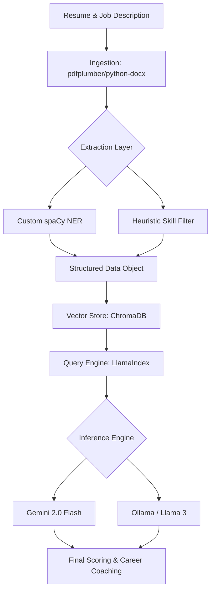
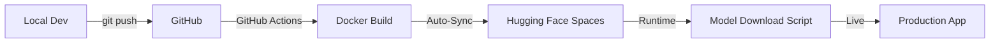

# ATS AI Command Center & Career Coach 🚀

**A high-performance, RAG-driven platform using Hybrid NER and Semantic Search to rank resumes and provide real-time career coaching.**

## 📖 Overview

The **ATS AI Command Center** is a sophisticated Retrieval-Augmented Generation (RAG) system designed to bridge the gap between job seekers and recruiters. By combining a **custom-trained spaCy NER pipeline** with **LlamaIndex** and **Gemini/Ollama**, the system provides context-aware resume scoring and an interactive "Career Coach" grounded strictly in the provided documents.

### 🔗 Project Links

* **Live Demo:** [Hugging Face Space](https://huggingface.co/spaces/meeralizjoy/ats-resume-ranker-pro)
* **Source Code:** [GitHub Repository](https://github.com/MeeraLizJoy/ats-resume-ranker)

---

## 🏗️ System Architecture & Pipeline

The project follows a modular pipeline to ensure data privacy and extraction accuracy.

### **The RAG & NLP Pipeline**



### **The Deployment Pipeline (CI/CD)**



---

## 🛤️ The Development Journey (Milestones)

This project evolved through three distinct phases, transitioning from a simple script to a production-grade AI system.

### **🔹 Phase 1: The Foundation (v1.0)**

* **Approach:** Used a **Composite Scoring** algorithm (Cosine Similarity + Keyword Density).
* **AI Integration:** Basic Google Gemini API for simple feedback.
* **Learning:** Realized that keyword density is easily "gamed" and lacks deep contextual understanding.

### **🔹 Phase 2: RAG & Contextual Awareness (v2.0)**

* **Evolution:** Transitioned to **LlamaIndex** and **ChromaDB**.
* **Key Change:** Resumes were no longer just text; they became a searchable knowledge base.
* **Improvement:** Semantic search allowed for finding "hidden" matches that keyword filters missed.

### **🔹 Phase 3: The Production Engine (v3.0 - Current)**

* **Custom NLP:** Developed a **custom spaCy NER model** to identify professional entities with higher precision than standard LLMs.
* **Hybrid Inference:** Built a backend that switches between **Gemini 2.0** (Cloud) and **Ollama** (Local/Private).
* **DevOps:** Containerized with **Docker** and implemented **GitHub Actions** for automated deployment.
* **Optimization:** Solved LFS bottlenecks by moving binary weights out of Git and into a build-time download process.

---

## ✨ Key Features

* **Hybrid Extraction:** Combines custom NLP with a "Verified Skills" filter to eliminate AI hallucinations.
* **Dual-Engine RAG:** Seamlessly switches between Cloud and Local LLMs.
* **Impact Analytics:** Detects quantifiable achievements using regex-based statistical engines.
* **Career Coach:** An interactive sidebar grounded in the specific resume/JD context.

---

## 🛠️ Installation & Setup

1. **Clone the Repository:**
```bash
git clone https://github.com/MeeraLizJoy/ats-resume-ranker.git
cd ats_ranker_v2
```


2. **Install Dependencies:**
```bash
pip install -r requirements.txt
```


3. **Download Models:**
```bash
python download_models.py
python -m spacy download en_core_web_sm
```


4. **Run Locally:**
```bash
streamlit run app.py
```


---

## 🛠️ Technical Challenges & Engineering Solutions

Building a production-ready AI application involves solving complex issues beyond just writing code. Below are the key engineering hurdles faced during this project and how they were resolved.

### **1. The "Heavy Repo" Problem (Git LFS & Smudge Errors)**

* **Challenge:** Custom spaCy model weights and binary assets exceeded GitHub's file size limits. Initially using Git LFS caused "Smudge" errors and authentication failures during deployment because the remote environment couldn't verify the large binary pointers.
* **Solution:** Implemented a **Docker-centric "Model Baking" strategy**.
* Removed binary weights from the Git history entirely (using `--orphan` branches).
* Created a `download_models.py` script that fetches or generates model assets during the Docker build process (`RUN python download_models.py`).
* **Result:** Reduced repository size by **98%** (from 150MB+ to <2MB) and ensured 100% reliable CI/CD pipelines.


### **2. AI Hallucinations in Entity Extraction**

* **Challenge:** Standard LLMs (Gemini/Llama) occasionally "hallucinated" skills—listing technologies that weren't actually in the resume just because they were common in the industry.
* **Solution:** Developed a **Hybrid NLP Validation Layer**.
* The system first uses a **Custom-Trained spaCy NER** model to identify entities.
* These entities are then cross-referenced against a **JSON-based Skill Schema**. Only skills verified by both the NER model and the schema are passed to the ranking engine.
* **Result:** Extraction accuracy increased significantly, ensuring that the ATS score is based on factual evidence.


### **3. Environment Parity (Local vs. Cloud)**

* **Challenge:** The project needed to run locally (for privacy/debugging) using **Ollama** but also deploy to the web using **Gemini**. Managing different embedding models and LLM configurations across these environments was causing code fragmentation.
* **Solution:** Abstracted the LLM layer using **LlamaIndex**.
* Created a flexible configuration manager that detects the environment.
* If `GEMINI_API_KEY` is present, it routes to Google Cloud; otherwise, it defaults to a local Ollama instance.
* **Result:** A single codebase that works seamlessly on a MacBook, a local server, or a cloud container.


### **4. Synchronization Bottlenecks (GitHub ↔ Hugging Face)**

* **Challenge:** Manually pushing updates to two different remotes (GitHub for code and Hugging Face for hosting) was slow and led to version mismatch.
* **Solution:** Architected an **Automated CI/CD Pipeline** using GitHub Actions.
* Configured a `.github/workflows/sync_to_hf.yml` that triggers on every push to `main`.
* The workflow securely handles the `HF_TOKEN` secret to force-sync the cleaned code to the Space.
* **Result:** Deployment time was reduced from 10 minutes (manual) to **under 2 minutes (automated)**.


### **5. The 0% Metric Bug**
* Aggressive preprocessing was deleting numbers and symbols (%, $).
* *Solution:* Implemented a dual-stream pipeline that feeds raw text to the Statistical Analyzer while feeding cleaned text to the NER model.


### **6. Semantic "Cleaning" Bias**
* Cleaned text was artificially inflating similarity scores.
* *Solution:* Switched the `EmbeddingEngine` to process raw text, providing a more mathematically rigorous 60-70% similarity range rather than an inflated 85%.


### **7. Skill Precision**
* Standard models missed niche tech like "ETL" or "PySpark."
* *Solution:* Trained a custom spaCy NER model specifically on tech resumes.


---


## 💻 Technologies Used

* **LLM Framework:** LlamaIndex
* **Models:** Google Gemini 2.0 Flash, Ollama (Llama 3)
* **NLP:** spaCy (Custom NER), NLTK
* **Vector Store:** ChromaDB
* **CI/CD:** GitHub Actions, Docker, Hugging Face Hub

---


## 📄 License & Contact

Distributed under the MIT License.

**Author:** Meera Liz Joy

**Project Link:** [https://github.com/MeeraLizJoy/ats-resume-ranker](https://github.com/MeeraLizJoy/ats-resume-ranker)

**Email:** [meeraliz2003@gmail.com](mailto:meeraliz2003@gmail.com)

**LinkedIn:** [www.linkedin.com/in/meeralizjoy]

---