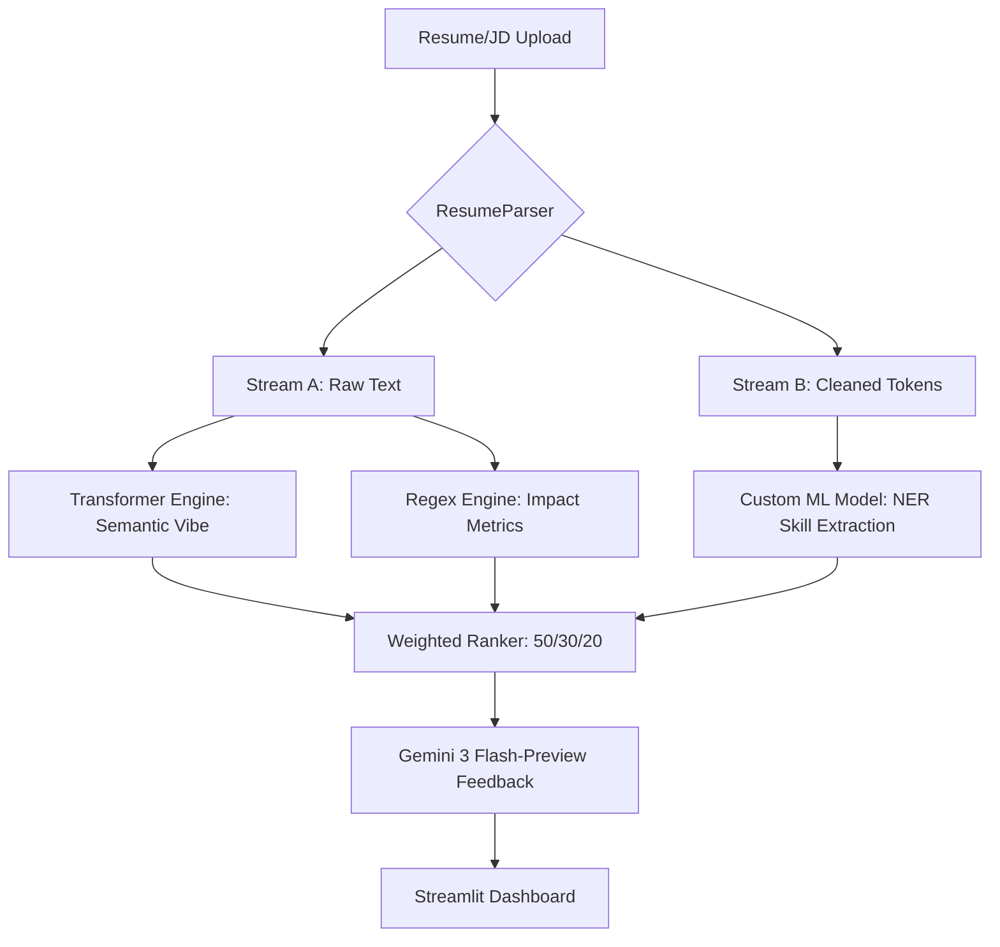

# 🚀 AI-Powered ATS Resume Ranker (V2)

An advanced Applicant Tracking System (ATS) simulator. Unlike standard keyword-matching tools, this system features a **custom-trained Machine Learning model** for high-precision entity extraction and transformer-based semantic analysis.

## 🎯 Project Objective

The goal was to move beyond "dumb" keyword search. By training a specialized **ML model**, the system can distinguish between generic text and actual technical skills, providing a more "human-like" evaluation of a candidate's profile.

---

## 🧠 The Machine Learning Core

The "brain" of this project is a **Custom spaCy NER Model** specifically trained to recognize technical competencies in a resume context.

### 1. Model Training & Development

* **Framework:** spaCy v3.x
* **Dataset:** Annotated resume dataset with custom `SKILL` entities.
* **Training Pipeline:** * Performed data augmentation on raw resumes.
* Annotated entities using an IOB (Inside-Outside-Beginning) tagging scheme.
* Optimized the model using a standard spaCy training pipeline to produce `model-best`.


* **Precision:** The model is trained to identify niche technologies (e.g., *ETL, PySpark, Kubernetes*) that standard NLP models often overlook.

### 2. The Semantic Engine

* **Transformer Model:** `all-MiniLM-L6-v2`
* **Function:** Converts raw text into 384-dimensional dense vectors to calculate **Cosine Similarity**. This allows the system to understand that "Software Engineer" and "Full Stack Developer" are semantically related even if the words don't match exactly.

---

## 🏗️ Technical Architecture (Dual-Stream)

The system uses a unique architecture to ensure that the ML model gets "clean" data while the statistical engine keeps "raw" data for metric detection.



---

## 🛠️ Tech Stack

* **ML/NLP:** spaCy (Custom Trained Model), Sentence-Transformers (BERT-based)
* **LLM:** Google Gemini 3 Flash Preview (API)
* **Visualization:** Plotly (Radar Charts)
* **Frontend:** Streamlit
* **Data Parsing:** pdfplumber, python-docx

---

## 🚀 Execution Guide

### 1. Model Setup

Ensure your trained model is located in the `/output/model-best` directory as the `LocalSkillExtractor` looks for it there.

### 2. Installation

```bash
pip install -r requirements.txt
python -m spacy download en_core_web_sm

```

### 3. Running the App

```bash
streamlit run app.py

```

---

## 🧠 Challenges & Solutions

* **The 0% Metric Bug:** Aggressive preprocessing was deleting numbers and symbols (%, $).
* *Solution:* Implemented a dual-stream pipeline that feeds raw text to the Statistical Analyzer while feeding cleaned text to the NER model.


* **Semantic "Cleaning" Bias:** Cleaned text was artificially inflating similarity scores.
* *Solution:* Switched the `EmbeddingEngine` to process raw text, providing a more mathematically rigorous 60-70% similarity range rather than an inflated 85%.


* **Skill Precision:** Standard models missed niche tech like "ETL" or "PySpark."
* *Solution:* Trained a custom spaCy NER model specifically on tech resumes.


---

## 📈 Future Roadmap

* **Batch Processing:** Support for uploading multiple resumes simultaneously for recruiter-view rankings.
* **Contextual Bullet Re-writing:** Use Gemini to automatically suggest rewrites for low-impact resume bullets.
* **Deployment:** Containerization with Docker for cloud deployment on AWS/Azure.

---


## 📄 License & Contact

Distributed under the MIT License.

**Author:** Meera Liz Joy

**Email:** [meeraliz2003@gmail.com](mailto:meeraliz2003@gmail.com)

**LinkedIn:** [www.linkedin.com/in/meeralizjoy]

---

